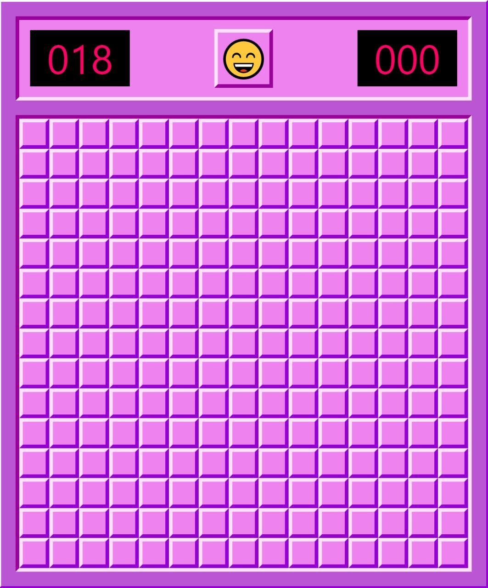
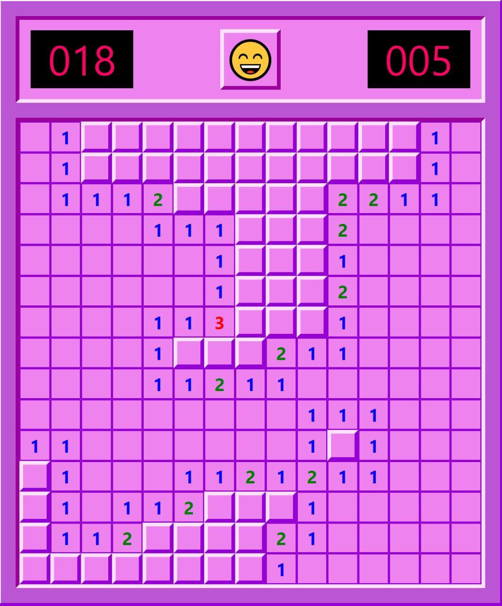
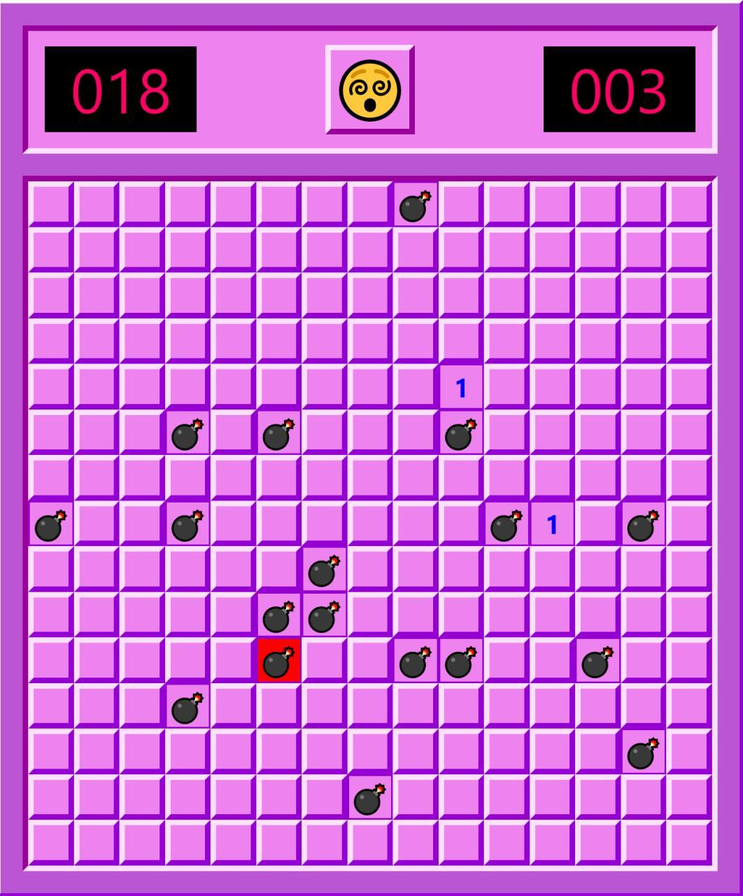

# Minesweeper
Minesweeper in React &amp; Typescript

Start project with: npm start

## Game
The game has an implemented clock, so that time is limited and the game can be refreshed at any moment by clicking on the smiley face.

